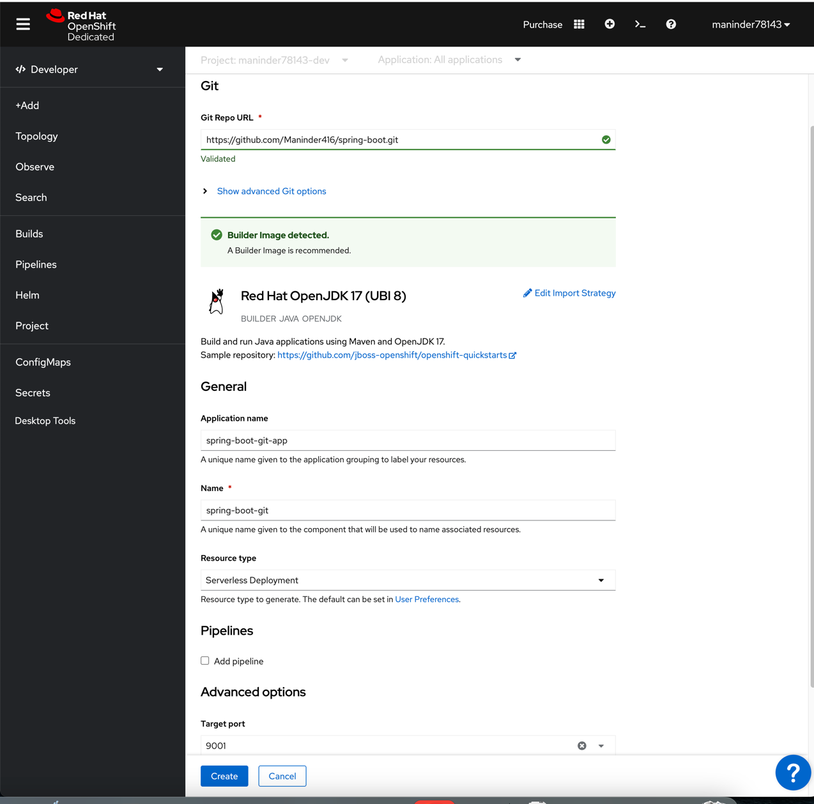
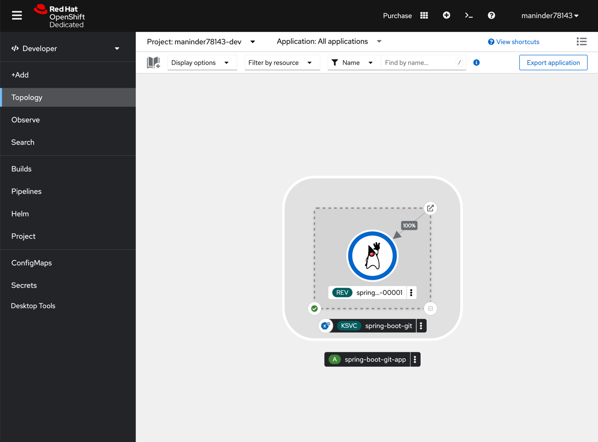
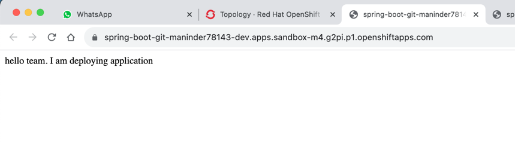

### Deployed spring boot app on open shift.

```shell
First of all, we cannot deploy this spring boot app on open shift because it is child
branch and when we deploy to open shift we need to provide the repository path
like this:
https://github.com/Maninder416/spring-boot.git

and by default, it will deploy the main branch code on your open shift not this child branch code.

1. So if you want to deploy this code to open shift, merge your code to main branch.

```

# Steps to deploy spring boot app on open-shift:

```shell
1. Create open-shift account. will give you 30 days trail:
https://console-openshift-console.apps.sandbox-m4.g2pi.p1.openshiftapps.com/topology/ns/maninder78143-dev?view=graph

2. Username and password are shared on reactivestax personal slack chat.
3. Choose the developer option.

```


```shell
4. Then click on "+Add" option and select "Git repository, import from git option".

```


```shell
5. Then you need to pass the repository here.
```


```shell
6. Provide the basic information like which target port you want to access and app name.

```


```shell
7. Click on create button and it will deploy your application and give you url.
8. Wait until penguin logo come and then try to access your application.
```





```shell
If our spring boot app is running with docker-compose mysql,
in that case we run the docker mysql first and then run our integration
test cases, but in spring 3.1.0, they have implemented the functionality
of containers. 

you just need to mention the container name and on the behalf of
that you can run your spring boot integration test cases
without running the spring boot app.

Steps:
1. Added the required dependencies in POM.
2. Created one container class, in which we mention that we need these
containers.
3. Created the TestApplication, in which we mention that this is our
main class and also pass the reference of container class from which
it can pick the required container to run spring boot app.
4. Suppose, our spring boot app is running with mysql so it pick the 
container information from container class and used it in our spring boot
app.
5. Also added the logging for test cases.

video reference:
https://www.youtube.com/watch?v=UuLD9gZmiZU&ab_channel=SivaLabs

```