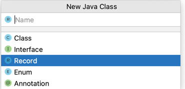
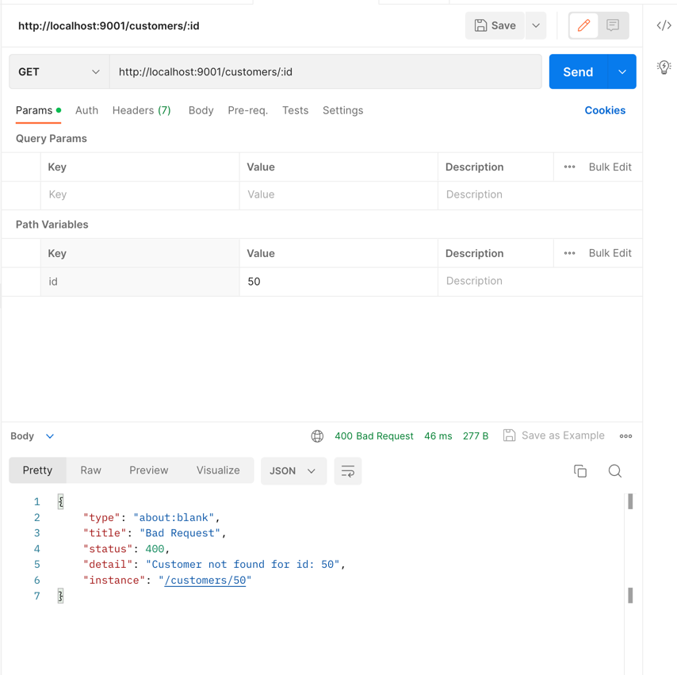
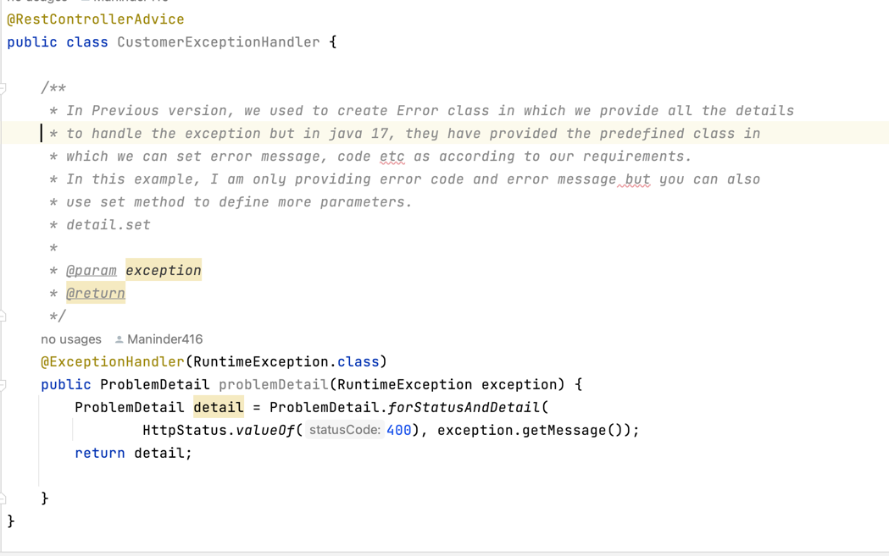
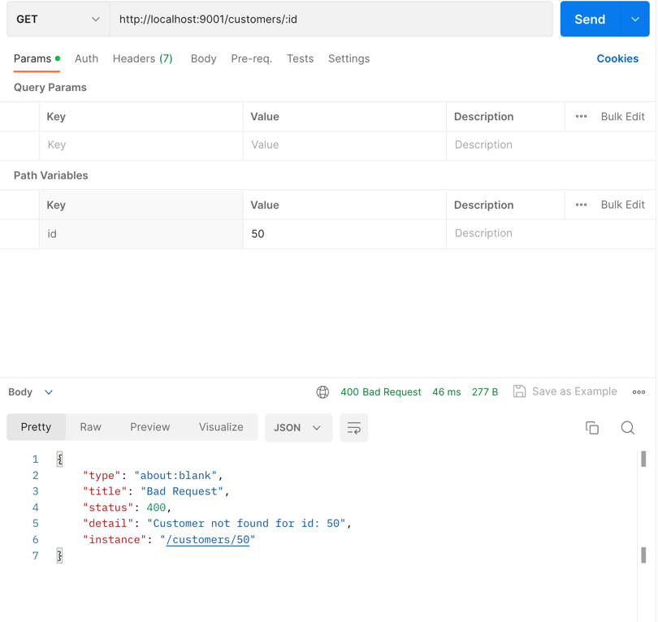

### Spring boot 3.1.0 with java 17.

**Covering the concept of new spring boot with java 17**

```shell
1. Used record class: java 14 provides new concept of record instead of
creating class. There are many benfits to using it:
1. No need to create constructor
2. No need to implement for hashcode and toString method.
3. No need for getter method.
4. Record are inherently immutable, meaning that field cannot be changed
after they created.

So basically to avoid boiler plate code, they launch the concept of record.

```


**Added the ProblemDetail class**

```shell
1. Earlier, we used to create one error class for displaying the error code
in better way like below mention screenshot.

```

```shell
2. But now they launch the problemDetial class, in which we can set the error
code values as according to our requirements.

```


```shell
3. Output be like this:

```

