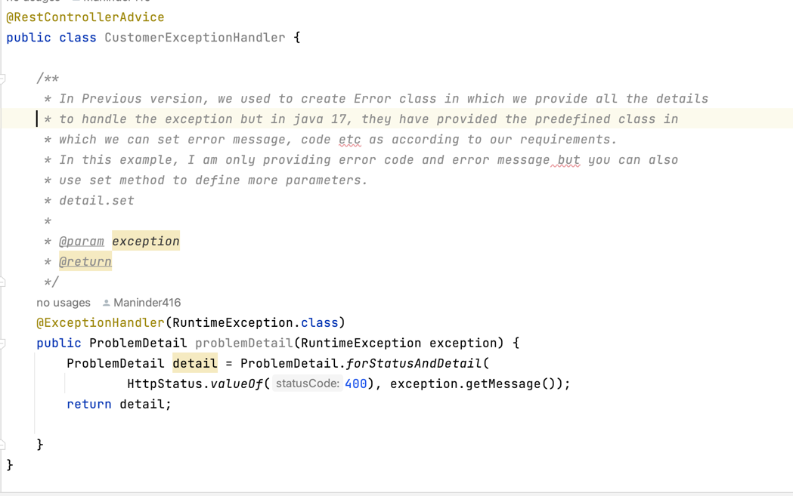

### Spring boot 3.1.0 with java 17.

**Covering the concept of new spring boot with java 17**

```shell
1. Used record class: java 14 provides new concept of record instead of
creating class. There are many benfits to using it:
1. No need to create constructor
2. No need to implement for hashcode and toString method.
3. No need for getter method.

So basically to avoid boiler plate code, they launch the concept of record.

```
