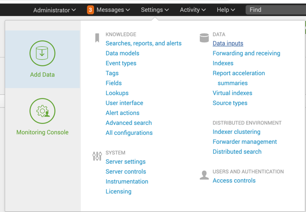
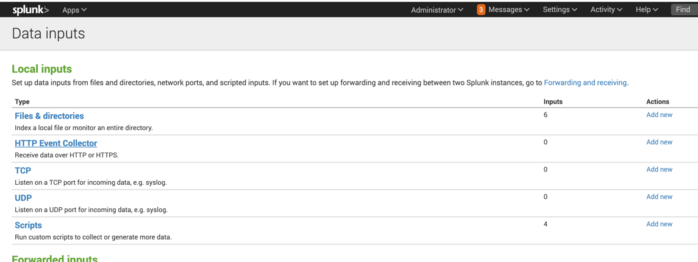
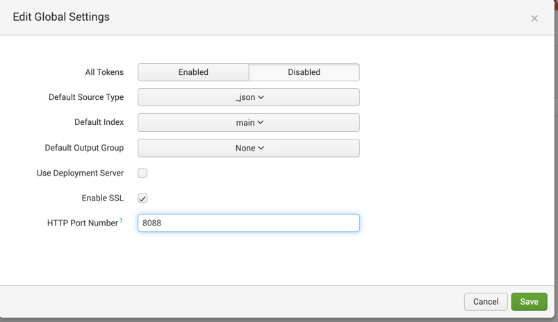
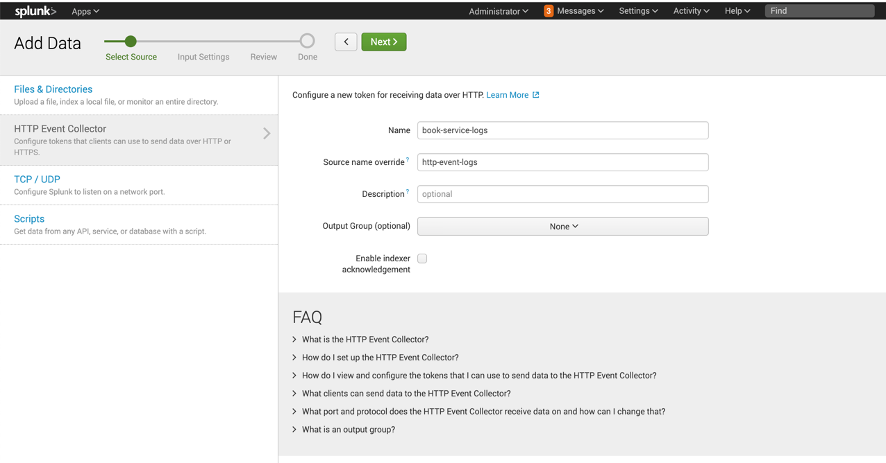
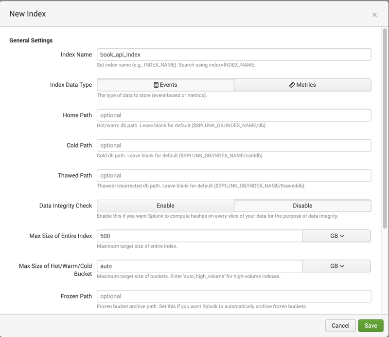
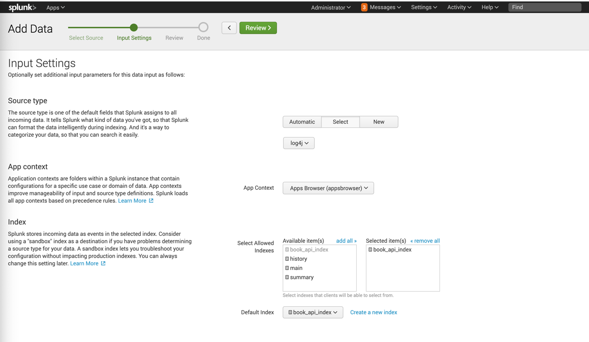
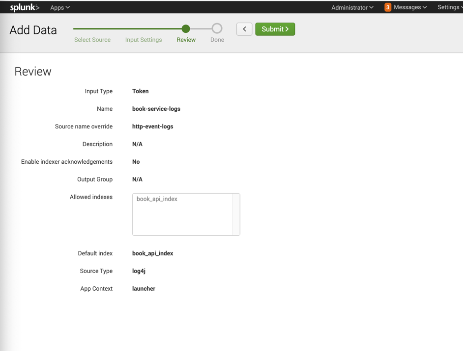
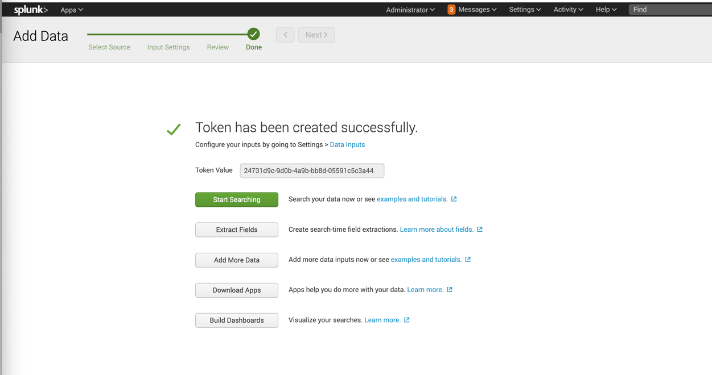
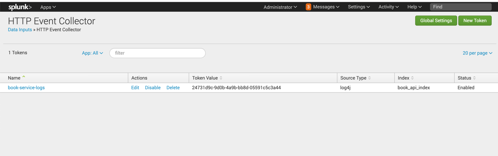

### Spring boot app with splunk


### Topics covered in this spring boot app:
```shell
1. Docker mysql running local spring boot app.
2. CRUD operation
```

### How to run spring boot app:
```shell
1. Need to run docker-compose file first as we are using docker mysql, splunk
2. Run the spring boot app.
```

### What is Splunk and we do we need it?
```shell
It is a powerful tool, with the help of this you can monitor real time logs of your application. 
It allows you to analyse data and logs through a web interface. 

Why it comes?

Suppose we have 3 microservices called:
1.	Order-service
2.	Inventory service.
3.	Payment service.

All the logs going for this entire application is into the logs file. Suppose you have issue in
inventory service and even you know that, but you need to find out the error in logs which 
contains the logging of entire application. It is difficult to find the errors as logs file 
contains the logging of entire application. So, to segregate the logging of microservices splunk
comes into picture. 

```


### Setup of splunk
```shell
We can use docker-compose splunk for local testing. After running this, we need to configure
some settings that are required for our spring boot app to send logs over splunk because how
our spring boot application knows where to send all the details?
We need following details for setup:

```













