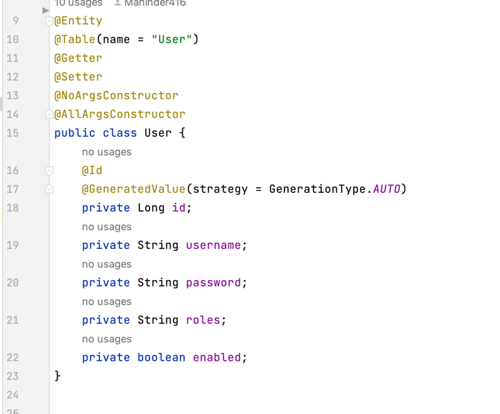
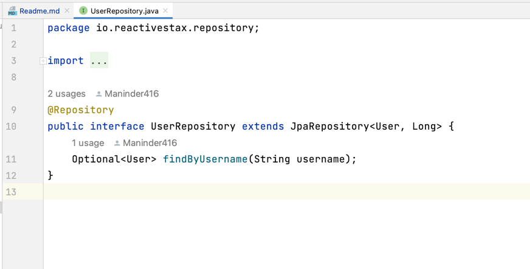
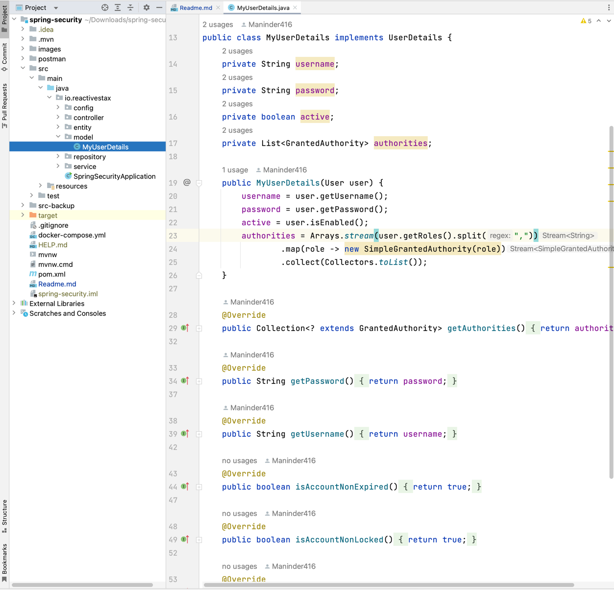
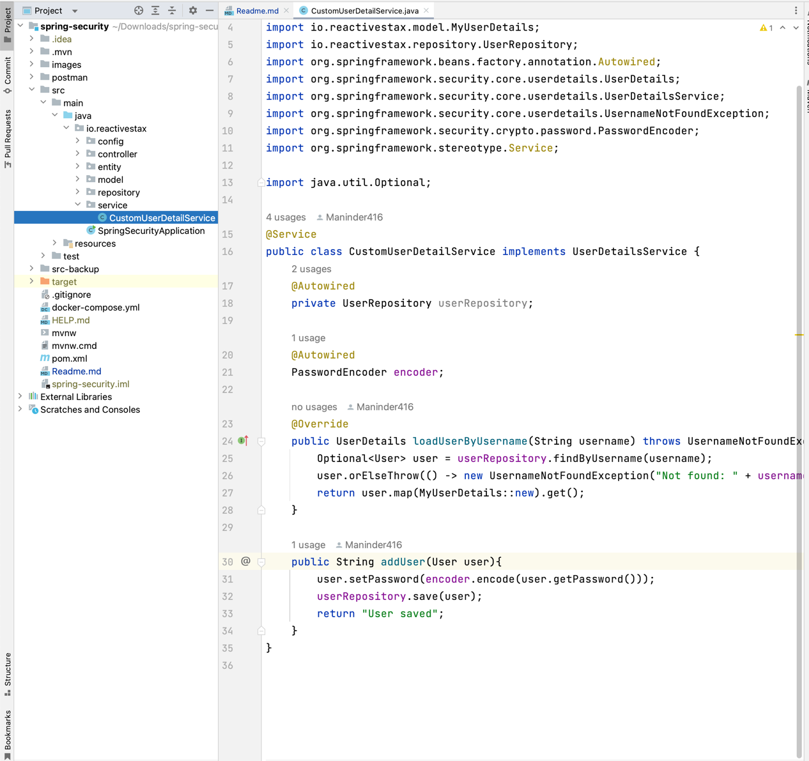
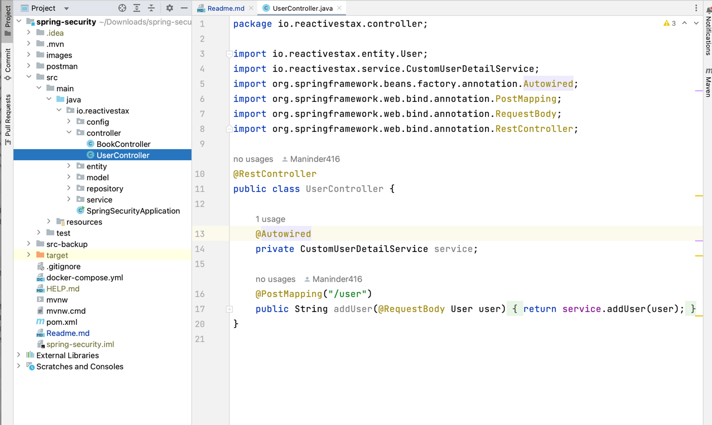
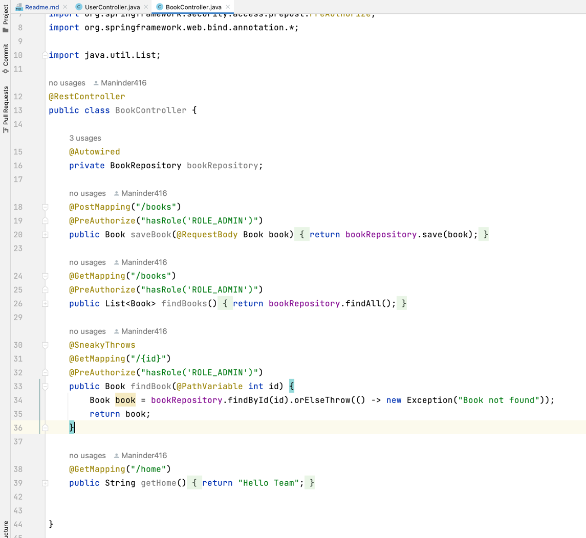

### Spring security without WebSecurityConfigureAdapter Class

```shell
1. Below is the code with latest spring security changes:
2. Saving the password in encrypted form while saving the user.
3. "/user", for creating the new user which has roles assigned.
```















**User creation:**
```shell

http://localhost:9001/user
{
    "username": "maninder",
    "password": "maninder",
    "roles": "ROLE_ADMIN",
    "enabled": true
}

```