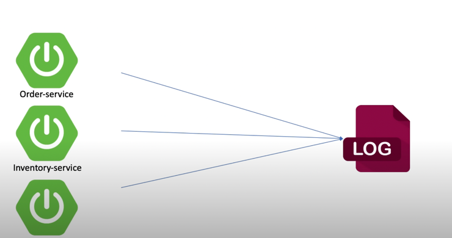
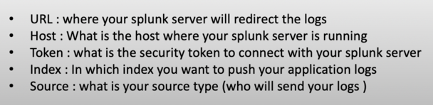

# Spring boot with kafka:

```shell
Steps to run spring boot app:
1. Run docker compose.
2. Run the spring boot app.
3. login to "http://localhost:9021/" and add connectors.
4. upload the connectors that are placed inside the connectors folder.
5. We have created the service layer which is generating the data.
6. creating 2 classes(Employee and Address) and using stream we have merged 2 topics into one.
7. Basic diagram of this project.

```


```shell
1. These connectors will automatically upload the table data into topic.
2. Using stream, we have combined this data and send to next topic.

```

# How to create kTable in KSQL:

```shell

Command to connect KSQL:
1. From command line, connect KSQL:
ksql http://localhost:8088

2. Set autooffset reset:
SET 'auto.offset.reset' = 'earliest';

3. Command to list connectors:

show connectors;

4. How to check config of connectors:
curl http://localhost:8083/connectors/testing/MYSQL_SOURCE_CONNECTOR2 |jq

5. if you want to create connectors using command line in KSQL:

```

```shell

CREATE SOURCE CONNECTOR mysql_source_connector2
WITH (
  'connector.class' = 'io.confluent.connect.jdbc.JdbcSourceConnector',
  'connection.url' = 'jdbc:mysql://mysqldb:3306/kafka',
  'connection.user' = 'root',
  'connection.password' = 'root',
  'table.whitelist' = 'employee',
  'mode' = 'incrementing',
  'incrementing.column.name' = 'emp_id',
  'topic.prefix' = '',
  'key'='emp_id',
  'key.converter'='org.apache.kafka.connect.storage.StringConverter',
  'value.converter'='org.apache.kafka.connect.json.JsonConverter',
  'value.converter.schemas.enable' = false
);

6. After creating connectors, creating KTable using below mentioned command.
 a. connect to KSQL.
 b. run below command.

```

```shell

CREATE TABLE employee
(
    emp_id          VARCHAR PRIMARY KEY,
    emp_name        VARCHAR(50),
    email_address   VARCHAR(50),
    age VARCHAR(50),
    phone_number VARCHAR(50)
)
    WITH (
        KAFKA_TOPIC = 'employee', -- The topic in which we added the players
        VALUE_FORMAT = 'JSON', -- The format in which the data is written
        PARTITIONS = 1
        );
          
```

```shell

CREATE TABLE address
(
    emp_id          VARCHAR PRIMARY KEY,
    street_number        VARCHAR(50),
    city_name   VARCHAR(50),
    country_name   VARCHAR(50),
    postal_code   VARCHAR(50),
    state VARCHAR(50),
    street_name VARCHAR(50)
)
    WITH (
        KAFKA_TOPIC = 'address', -- The topic in which we added the players
        VALUE_FORMAT = 'JSON', -- The format in which the data is written
        PARTITIONS = 1
        );

```
7. Now, when you have updated anything, data will send to topic and then merged using stream and send to next topic.


