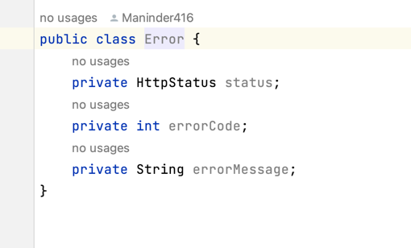

### Spring boot 3.1.0 with java 17.

**Covering the concept of new spring boot with java 17**

```shell
1. Used record class: java 14 provides new concept of record instead of
creating class. There are many benfits to using it:
1. No need to create constructor
2. No need to implement for hashcode and toString method.
3. No need for getter method.
4. Record are inherently immutable, meaning that field cannot be changed
after they created.

So basically to avoid boiler plate code, they launch the concept of record.

```


**Added the ProblemDetail class**

```shell
1. Earlier, we used to create one error class for displaying the error code
in better way like below mention screenshot.

```

```shell
2. But now they launch the problemDetial class, in which we can set the error
code values as according to our requirements.

```


```shell
3. Output be like this:
```


**Spring Native**
```shell
When we start the application, see the tomcat time which takes to start the
application. For example: "SpringTestApplication in 2.098 seconds"

When we run the application, it loads all the code and convert it into
byte code and then JVM convert this byte code to machine code and this
steps we are doing each time.

We need to install GraalVM, below are the steps:
export GRAALVM_HOME="/Users/manindersingh/Downloads/graalvm-ce-java17-22.3.2/Contents/Home"
export PATH="/Users/manindersingh/Downloads/graalvm-ce-java17-22.3.2/Contents/Home/bin:$PATH"
export JAVA_HOME="/Users/manindersingh/Downloads/graalvm-ce-java17-22.3.2/Contents/Home"

java -version

OpenJDK Runtime Environment GraalVM CE 22.3.2 (build 17.0.7+7-jvmci-22.3-b18)

After changing this, make sure to change the java version used by maven. If it is not using
17 then set it:

when you execute: mvn --version it will tell you path where it installed:

cd /opt/homebrew/Cellar/maven/3.9.1/bin
here vim mvn
provide the java path which you want to set:

JAVA_HOME="${JAVA_HOME:-/opt/homebrew/opt/openjdk@17/libexec/openjdk.jdk/Contents/Home}"

After that run this command:

mvn -Pnative -DskipTests native:compile

first time this command will take time.

in target folder, file is created name like:
spring-3-test.build_artifacts.txt

This file will tell you the batch file name:

basically the batch file is created under target folder.
Somehow our application is not working. We need to check it but this approach come to improve the performance.

```

**HTTP Exchange**
``` 
Earlier we used weblclient for rest API calls.

WebClient is a powerful and flexible HTTP client in Spring that has been available
since Spring 5.0. It provides a non-blocking, reactive API that is suitable for
high-concurrency, high-throughput use cases.

However, some developers have found WebClient to be somewhat verbose and difficult
to use in some scenarios. For example, when calling an external REST API that has
many endpoints and complex request/response structures, it can be challenging to
write and maintain the code needed to consume the API using WebClient. 
Additionally, WebClient requires some degree of familiarity with reactive
programming concepts and APIs, which can be a learning curve for developers
who are not yet familiar with them. To address these challenges, Spring 5.3
introduced HttpServiceProxyFactory, a new approach for consuming HTTP-based 
APIs that provides a more declarative, strongly-typed API. With 
HttpServiceProxyFactory, developers can define a simple interface that describes
the HTTP service, and Spring generates a dynamic proxy that implements that
interface and handles the HTTP requests and responses. This approach can simplify
the code needed to consume a REST API and can make it easier for developers to
work with HTTP-based services in Spring.

So, the issue that HttpServiceProxyFactory aims to address is not with WebClient
per se, but rather with the complexity of consuming REST APIs using a low-level
API like WebClient. HttpServiceProxyFactory is an alternative approach that
provides a higher-level, more declarative API for consuming REST APIs in Spring.

To understand this, we created a new module called "client".


```

**Observability feature**
```shell
1. Launch the new feature, in which we can track the information like how 
many times someone hit this endpoints. We can use this information in 
creating the dashboard like graphana, it is same as sleuth server but not
a replacement.
```


