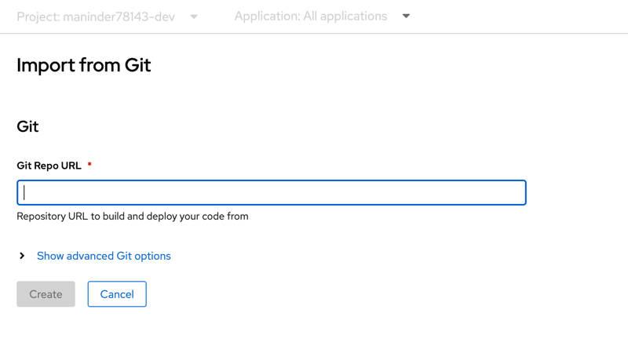

### In this branch we will learn to configure:
```shell
1. zipkin and sleuth
2. config server
3. eureka server
```

### How to configure eureka server in spring boot

### Why there is a need of eureka server?
```shell
The eureka server which is a part of Netflix ’suite of tools, is commonly used in spring boot
applications for service discovery. Suppose you are working on an enterprise 
application and using multiple microservices for your requirements and these
microservices are communicate with each other to get some data or processing 
something. Let’s take an example of payment service and order service. 
For order something you have to call the payment service. So, both these
 microservices are calling each other, right?

When you want to call payment service from inside the order service you should
the payment service IP address. One way is to hardcode the IP address of payment
service inside the order service. Is it right way to do it?

There are a lot of security issues because you are providing IP address. 
Moreover, if any case your payment-service location has been changed. 
In this case, IP address will change, and you need to update the IP address
inside the order service for connectivity. Plus, you might have multiple 
instances running of each service at different locations, and you’d want to
balance between them.

Eureka server provides the solution for these problems. It acts like a phone book
for your services. You need to register the service inside the eureka server. 
Suppose order and payment service you register inside the eureka server then
order service ask eureka server to find the payment service. If it’s find then
it will connect to you with that service and you are just providing the name of 
service for registering and even in the case of IP address changes it will work
fine. 

Even eureka server supports health check, which means if any service goes down,
it will automatically be removed from the server registry, so that other services
will not try to interact with failed service because it register the service when
you start the service and when service don’t start and it will not able to 
register it in eureka server.

for load balancing purpose, we want to scale up the microservice 1 and we will 
start more instances of microservice1. Like we discussed above microservice 2 
was down. So how to make sure which services are up and down we use service
 registry pattern. Api gateway connects to the service registry, and it knows
which microservices are up and down. 


```

```shell
In this example: we are configuring:
1. eureka server
2. order service
3. payment service

order is calling payment service for transaction using the name registerd under
eureka server so even in the case of IP changes it will work.

It will also give you health check functionality. With the help of that it will
check either the application is working or not.

It will also provide you the dashboard for interface for more clarrification.
```

### How to configure it
```shell
To configure it:
1. add pom dependency for eureka server
2. add the spring cloud dependency. Make sure it is compatible with spring boot version
. I had some issues while connecting to it.
3. Enabled eureka server using @EnableEurekaServer annotation.
4. add this configuration in yml file:

eureka:
  client:
    registerWithEureka: false
    fetchRegistry: false

spring:
  application:
    name: AMAZON-SERVER
    
it is just saying that it is not a eureka client. it's server so we marked it false.
5. default port for eureka server is : 8761
6. On the client side, you need to add eureka client dependency and add annotation
called @EnableEurekaClient on spring boot application.

<dependency>
<groupId>org.springframework.cloud</groupId>
<artifactId>spring-cloud-starter-netflix-eureka-client</artifactId>
</dependency>

7. added this properties into both yml file:

eureka:
  client:
    registerWithEureka: true
    fetchRegistry: true
    serviceUrl:
      defaultZone: http://localhost:8761/eureka/

  instance:
    hostname: localhost
    
passing the eureka server hostname and saying that yes it is client.

8. Hit the eureka server hostname along with port and you will get the dashboard:
  http://localhost:8761/
              
```


### what is zipkin and sleuth server.
```shell
for monitoring the logs like when machine is connecting and give you what 
response we use distributed tracing pattern to track it.

So, spring cloud gives you all that features, and you don’t need to write any 
boiler plate code for it so people use it. 

```


### Configuration of it

```shell
1. added sleuth and zipkin dependency into order and payment service along
with spring cloud dependency..

        <dependency>
            <groupId>org.springframework.cloud</groupId>
            <artifactId>spring-cloud-starter-sleuth</artifactId>
        </dependency>
        <dependency>
            <groupId>org.springframework.cloud</groupId>
            <artifactId>spring-cloud-sleuth-zipkin</artifactId>
        </dependency>
            <dependencyManagement>
        <dependencies>
            <dependency>
                <groupId>org.springframework.cloud</groupId>
                <artifactId>spring-cloud-dependencies</artifactId>
                <version>2021.0.5</version>
                <type>pom</type>
                <scope>import</scope>
            </dependency>
        </dependencies>
    </dependencyManagement>
    
2. how to run zipkin server?
copied the jar in zipkin-jar folder and run command:
java -jar zipkin-server-2.12.9.jar

3. add properties into yml file.

spring:
  zipkin:
    base-url: http://localhost:9411/
  sleuth:
    sampler:
      probability: 1.0
  application:
    name: PAYMENT-SERVICE
    
4. hit the endpoints.       
http://localhost:9003/payment
http://localhost:9004/order-payment

5. observe the trace of your request in zipkin dashboard:

```


### Config server

```shell
How to enable config server:
1. add config server pom dependency along with spring cloud dependency.

<dependency>
  <groupId>org.springframework.cloud</groupId>
  <artifactId>spring-cloud-config-server</artifactId>
</dependency>

2. add this configuration: providing the configuration for repo.

spring:
  application:
    name: config-server
  cloud:
    config:
      server:
        git:
          uri: https://github.com/Maninder416/config-server
          
3. on client side, like order service:
providing the config server host and profile.

spring:
  profiles:
    active: default

  application:
    name: ORDER-SERVICE
  config:
    import: configserver:http://localhost:9005
  cloud:
    config:
      profile: default          
          
          
4. Now it will pick properties from yml file present in git.

          
```
